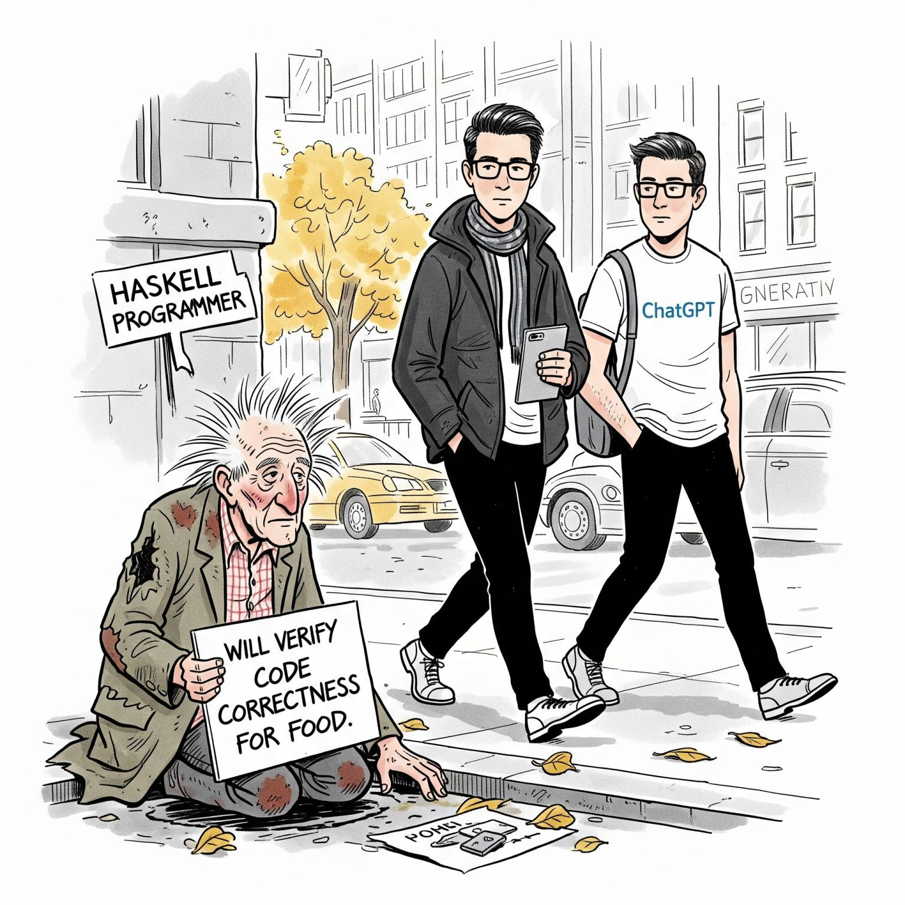

This is "Under Construction," as we used to say on Web 1.0.

See [Etceteras](./etceteras.html) for a stream of old blog posts and Twitter
one-liners and the like going back quite some time, and which I am slowing
working on populating.

### The last three ...

**...tech things...**

[Vibe
cartooning](https://www.linkedin.com/posts/evanswinner_generated-by-gemini-actually-activity-7346666322786775040-y2bw?utm_source=share&utm_medium=member_desktop&rcm=ACoAAAToB7IBYWlQOuR6-QEV548HsRJlAFbDzvU)
about vibe coding -- though I don't know if it was called that yet -- or formal
methods, or something. I just thought it was funny. A New Yorker-style cartoon
done by Google Gemini, I believe. (LinkedIn 2025.07)

Two

Three

**...non-tech things...**

One. This is a place holder.

Two

Three

