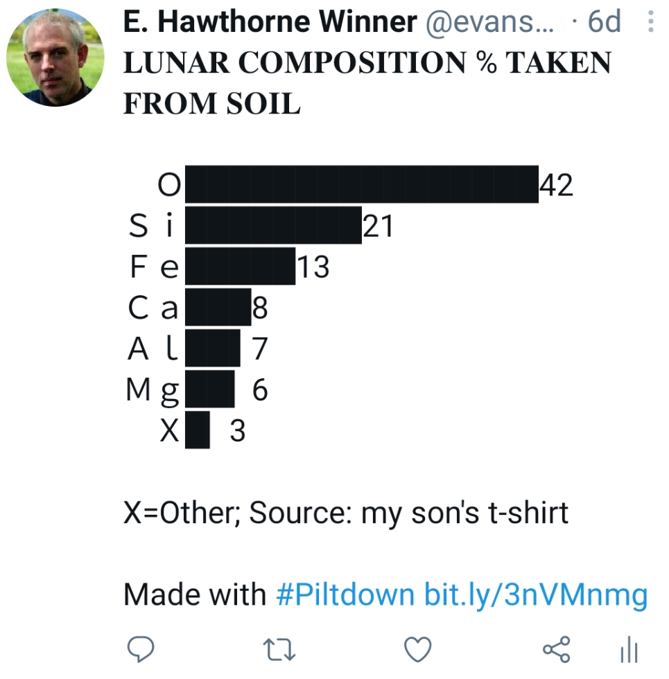

## Experiment & Analysis

[Do
“ultradian\” rhythms mediate my productivity throughout the
day?](status-log.html) — A quick analysis in **Rmarkdown**. (Local,
2018.1)

[Sound-pressure level at a large
datacenter](dc_spl.html) — One ought to wear
earplugs in a noisy datacenter. **Rmarkdown** (Local, 2018.2)

## Tools

[Piltdown](https://github.com/EvansWinner/piltdown)
   - Python Unicode-based data visualization for Twitter posts. (Github, 2021) 

[Kallychore](https://github.com/EvansWinner/kallychore)
   — Plain-text code notebook processor for mixing text and bash code,
   a little like Rmarkdown mixes Markdown and R. **Bash** with
   embedded **awk**. (Github, 2018)

[Todostack.el](https://github.com/EvansWinner/todostack.el) — A
   to-do list as a stack, written in **Emacs Lisp**. (Github,
   2011). Some
   [description](http://thornepublic.blogspot.com/2018/03/todostack.html)
   on Blogspot.

## Simulation

A [simulator](https://github.com/EvansWinner/ajsim) from scratch in
**Common Lisp** for some of IBM’s [AJS job
scheduler](https://www.ibm.com/support/knowledgecenter/en/ssw_ibm_i_74/rzasn/rzasnajsmanage.htm)
that I actually used for validating schedules on production
machines. (Github, 2013)

A little eBay auction simulator,
[auctions.py](https://gist.github.com/EvansWinner/064932a724caa2c816a768792a6903da)
using **simpy**.

## Mathy stuff

[Playing
with The Möbius Function in bash](mobius.txt) — A visualization
of the Möbius function and related things, using **Bash**, **Gnuplot**, and **Awk**. (Local, 2018.4)

[Number Chunking with Chunky
Numbers](https://www.linkedin.com/pulse/group-long-hand-written-numbers-smaller-sub-units-better-evans-winner/)
— A slightly tongue-in-cheek analysis of how to chunk multi-digit
numbers when writing them down. Inspired by a true story (LinkedIn,
2018.03)

## Demonstrations

[Set Operations with Bash](sets.html) — A
demonstration/tutorial. (Local, 2018.4)

[A K-nearest neighbor classifier in "pure" Bash](kNN.html). (Local, 2019.7)

## Documentation and How-to

[Awesome Line Editors](https://github.com/evanswinner/awesome-line-editors)
— Information about old-fashioned "line editors" like the Unix ed(1) editor.
A work in progress. (Github, 2024).

[Tally Systems
for Hand Collection of
Data](https://www.linkedin.com/pulse/tally-systems-hand-collection-count-data-evans-winner/)
— Wherein is suggested a novel (I assume) method of making hand tally
marks for collection of count data. (LinkedIn, 2018.03.23)

[Using
Split-Screen mode in Android Nougat for Quicker Data
Entry](https://www.linkedin.com/pulse/using-split-screen-mode-android-nougat-easier-data-entry-evans-winner/)
— A quick how-to. (LinkedIn, 2018.03.03)

[Cartouche Links With
CSS](https://thornepublic.blogspot.com/2018/03/cartouche-links-with-css.html)
— Make links with **CSS** that look a little like ancient Egyptian
cartouches. (Blogspot, originally on evanswinner.com,
2012)

[seu-refcard](https://github.com/EvansWinner/seu-refcard) — A
cheatsheet (not written by me) re-coded in **Emacs**’ **org-mode**
format and converted to PDF for IBM's **SEU** editor used on the **IBM
i**. (Github, 2014)

## Opinion

[Why Your Systems People Need a
Sandbox](https://www.linkedin.com/pulse/why-your-systems-people-need-sandbox-evans-winner/)
— System administrators learn by doing. Give them a place to do
it. Opinion piece.  (LinkedIn, 2016.06.14)

[One Space or Two](http://thornepublic.blogspot.com/2018/03/one-space-or-two.html) —
In which is answered that age-old and ever-so crucial question: One or
two spaces between sentences? (Blotspot, orig. 2013)
       
## School work and misc. exercises

[Exploring the
BRFSS Data](intro_data_prob_project.html) — Final project from a
Coursera basic stats course on exploratory data analysis in which is
determined that 1) having kids makes you lose sleep, 2) Mondays don't
really suck, and 3) Colorado really is the healthiest state. Well,
more or less. **Rmarkdown** (Local, 2016)

[Math and Coding Exercises](http://github.com/evanswinner/math-and-coding-exercises) —
Lots of little exercises in **APL**, **Python**, **Fortran**, **C**, **Haskell**, **Forth**, and **Lisp**
from Project Euler, Rosetta Code, Project Lovelace, various books, etc.
