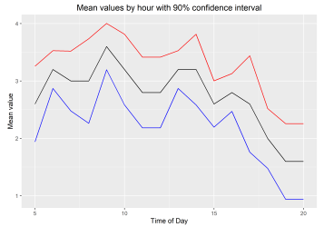
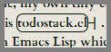

## Experiment & Analysis

 <b>[Do “ultradian\” rhythms mediate my
productivity throughout the day?](status-log.html)</b> (Local, 2018.1) 
An **Rmarkdown** notebook using a small, self-collected dataset.

"It appears that the results, though suggestive of a line with four peaks, could
actually be fit with a line with only a single peak or with a single,
monotonically decreasing curve, and still remain within the 90% CI."

 <b>[Sound-pressure level at a large
datacenter](dc_spl.html)</b> (Local, 2018.2)  Are sound levels dangerously high? An
**Rmarkdown** notebook examining the question using self-collected
readings.

"Continuous SPL levels in the main datacenter floor are too high for unprotected
long-term exposure. The NIOSH limit for 94 dB is 1 hour, and even assuming a
full 3 dB of inaccuracy in the measurment, at 91 dB, NIOSH still recommends no
more than 2 hours of continuous unprotected exposure. It therefore seems
reasonable to conclude that workers entering the main datacenter floor should
wear ear protection if they expect to be on the floor for more than a few
minutes, and might as well get in the habit of always having ear protection on
hand when entering the main datacenter floor."

## Tools

 <b>[Piltdown](https://github.com/EvansWinner/piltdown)</b>  (GitHub, 2021) 
Always wanted to use Python to generate data visualizations for your Twitter
posts using pure Unicode? No? Just me? Well, now you can anyway.
Despite the very tongue-in-cheek README, this does provide Python functions to
generate -- <b>column sparklines</b>, <b>win/lose sparklines</b>, <b>comparison
charts</b>, <b>horizontal bar charts</b>, <b>horizontal and vertical dot
charts</b>, <b>waffle charts</b>, <b>scaled-up
numbers</b>, <b>contingency and other simple tables</b>, and <b>tally charts</b>.

 <b>[Kallychore](https://github.com/EvansWinner/kallychore)</b> (GitHub, 2018) 
Kallychore is a plain-text code notebook processor for mixing text and bash
code, a little like Rmarkdown mixes Markdown and R. **Bash** with embedded
**awk**.

Rmarkdown is to an interpreted language as Kallychore is to a compiled
one. Kallychore makes a single pass over a plain-text (or Markdown) document
and interprets the embedded code blocks and outputs a single file with text,
code, and code output. 

<b>
[Todostack.el](https://github.com/EvansWinner/todostack.el)</b> (GitHub, 2011) 
A to-do list as a stack, written in **Emacs Lisp**. Some
[description](http://thornepublic.blogspot.com/2018/03/todostack.html) on
Blogspot. This is for people who have constant interruptions. When something
interrupts you, push a couple of words about what you are doing onto the
stack. Once you get back, pop the stack and see what you were doing. 

## Simulation

<b>[AJSIM](https://github.com/EvansWinner/ajsim)</b> (GitHub, 2013) 
AJSIM is a
simulator written from scratch in **Common Lisp** for some of IBM’s [AJS job
scheduler](https://www.ibm.com/support/knowledgecenter/en/ssw_ibm_i_74/rzasn/rzasnajsmanage.htm)
that I actually used for validating schedules on production machines. 

<b>[auctions.py](https://gist.github.com/EvansWinner/064932a724caa2c816a768792a6903da)</b> (GitHub Gist, ~2019) 
auctions.py is a little eBay auction simulator, using **simpy** in **Python**. 

## Mathy stuff

 <b>[Playing with The Möbius Function in
bash](mobius.txt)</b> (Local, 2018.4) 

A visualization of the Möbius function and related things, using **Bash**,
**Gnuplot**, and **Awk** in plain text. This uses the code "notebook" program
**Kallychore** (see above) 

<b>[Number Chunking with Chunky
Numbers](https://www.linkedin.com/pulse/group-long-hand-written-numbers-smaller-sub-units-better-evans-winner/)</b> (LinkedIn, 2018.03) 

A slightly tongue-in-cheek analysis of how to chunk multi-digit numbers when
writing them down. Inspired by a true story.

## Demonstrations

<b>[Set Operations with Bash](sets.html)</b> (Local, 2018.4) 
A demonstration/tutorial of defining standard set operations like union,
intersection, and Cartesian product, and calculating power sets of files in pure **bash**
with text lines considered as set elements. Written using **Kallychore** (see above).

 <b>[A K-nearest neighbor classifier in "pure"
Bash](kNN.html)</b>. (Local, 2019.7)  A demonstration of the power of **bash**,
implementing a kNN classifier and running it on the famous Iris dataset. Written
using **Kallychore** (see above).

## Documentation and How-to

<b>[Awesome Line Editors](https://github.com/evanswinner/awesome-line-editors)</b> (GitHub, 2024) 
A work-in-progress project to document old-fashioned "line editors" like the Unix **ed(1)** editor,
covering editors like qed, Teco, Edlin, Ecce, Sued, and others.

<b>[Tally Systems
for Hand Collection of
Data](https://www.linkedin.com/pulse/tally-systems-hand-collection-count-data-evans-winner/)</b> (LinkedIn, 2018.03.23) 
What I believe to be a novel method of making hand tally marks for collection of count data.

<b>[Using
Split-Screen mode in Android Nougat for Quicker Data
Entry](https://www.linkedin.com/pulse/using-split-screen-mode-android-nougat-easier-data-entry-evans-winner/)</b> (LinkedIn, 2018.03.03) 
A how-to on Android split-screen mode.

<b>[Cartouche Links With
CSS](https://thornepublic.blogspot.com/2018/03/cartouche-links-with-css.html)</b> (Blogspot, originally on evanswinner.com,
2012) 
How to make links with **CSS** that look a little like ancient Egyptian cartouches.

<b>[SEU editor refcard](https://github.com/EvansWinner/seu-refcard)</b>  (GitHub, 2014) 
A cheat-sheet (not written by me) re-coded in **Emacs**’ **org-mode**
format and converted to PDF for IBM's **SEU** editor used on the **IBM
i**.

## Opinion

<b>[Why Your Systems People Need a
Sandbox](https://www.linkedin.com/pulse/why-your-systems-people-need-sandbox-evans-winner/)</b> (LinkedIn, 2016.06.14) 
System administrators learn by doing. Give them a place to do it. Opinion piece.

 <b>[One Space or
Two](http://thornepublic.blogspot.com/2018/03/one-space-or-two.html)</b>
(Blotspot, orig. 2013)  In which is answered that age-old and ever-so
crucial question: One or two spaces between sentences?

## School work and misc. exercises

<b>[Exploring the
BRFSS Data](intro_data_prob_project.html)</b> (Local, 2016) 
Final project in **Rmarkdown** from a Coursera basic stats course on exploratory data analysis in
which is determined that 1) having kids makes you lose sleep, 2) Mondays aren't
really so bad, and 3) Colorado actually is the healthiest state. Well, more or
less.

<b>[Math and Coding Exercises](http://github.com/evanswinner/math-and-coding-exercises)</b> (GitHub, various dates) 
Lots of little exercises in **APL**, **Python**, **Fortran**, **C**, **Haskell**, **Forth**, and **Lisp**
from Project Euler, Rosetta Code, Project Lovelace, various books, etc.

